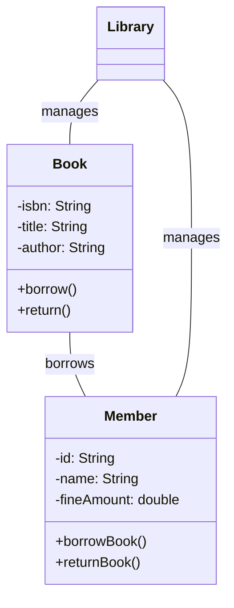

<div align="center">

# Library Management System
## Software Requirements Specification

### Object Oriented Programming Project
### Department of Computer Science
### Fall 2023

**Submitted By:**  
[Your Name]  
[Your Roll Number]  
BTech Computer Science (2nd Year)

**Submitted To:**  
[Professor's Name]  
Department of Computer Science

[University Name]  
[Date]
</div>

---

## Project Overview

This is a Java-based Library Management System that helps manage books and members in a library. The project demonstrates my understanding of:

- Object-Oriented Programming concepts
- Java Collections (ArrayList)
- Basic Data Structures
- File Handling
- User Interface Design

## 1. Features Implemented

### Core Features
1. **Book Management**
   - Add new books
   - Search for books
   - Display all books

2. **Member Management**
   - Register new members
   - View member details
   - Track borrowed books

3. **Borrowing System**
   - Borrow books
   - Return books
   - Calculate fines

## 2. Technical Details

### Class Structure


### Data Storage
- Using ArrayLists to store books and members
- In-memory data management
- Simple and efficient data access

## 3. Sample Code Implementation

```java
// Example of Book class implementation
public class Book {
    private String isbn;
    private String title;
    private String author;
    private boolean available;
}
```

## 4. Testing

| Test Case | Input | Expected Output |
|-----------|-------|----------------|
| Add Book | "Java Programming" | Success |
| Search Book | "Java" | Book Found |
| Invalid ISBN | "ABC" | Error Message |

## 5. Learning Outcomes

Through this project, I learned:
1. How to use ArrayList in Java
2. Object-oriented concepts like:
   - Classes and Objects
   - Encapsulation
   - Methods and Properties
3. Basic error handling
4. Command-line interface design

## 6. Future Enhancements

Features I plan to add in the future:
1. Database integration
2. GUI interface
3. Email notifications
4. Report generation

## Screenshots

[Add 2-3 screenshots of your running program here]

## References

1. Java Programming Tutorial
2. Data Structures in Java
3. Class Notes and Lab Materials
